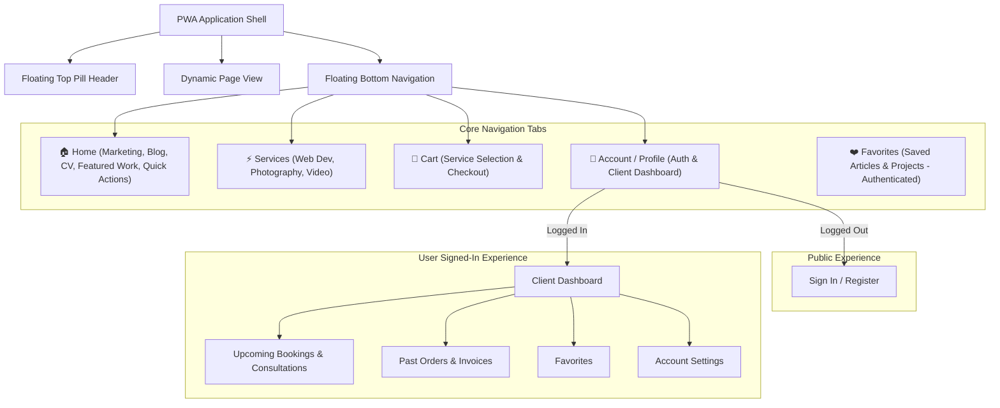

# Product Backlog: PWA Liquid Glass Transformation

> **Project**: [haikonguyen.eu](https://www.haikonguyen.eu)  
> **Target Release**: Modern Native-like Progressive Web App (PWA) with Liquid Glass Aesthetic  
> **Base Branch**: `feature/new-ui` (branched from `dev`)  
> **Design Inspiration**: `haianbeauty` architecture, iOS liquid glass design, mobile-first native PWA patterns.

---

## 🌟 1. Vision & Architectural Overview

The goal of this transformation is to evolve the current web portfolio into a high-performance, mobile-first **Progressive Web App (PWA)** featuring a **Liquid Glass** aesthetic. The app delivers a dual-context experience:

1. **Public View**: High-impact marketing & portfolio hub presenting personal brand narrative, latest articles (Keystatic + Cloudflare R2 CMS — see Epic 6), interactive CV, service offerings (Web Development, Photography, Video), cart, and quick-action launchers.
2. **Authenticated User View**: Native dashboard containing client profile status, upcoming service bookings with reschedule/cancellation, visit/inquiry history, saved favorites, and preferences.

### Key Design Pillars

- **Liquid Glass Aesthetic**: Translucent frosted glass layers (`backdrop-blur-2xl`, `border-white/10`, specular highlights, luminous cyan accents, soft ambient glows).
- **Mobile-First Native App Feel**: Floating top header pill, fixed floating bottom navigation bar with active tab indicators, spring animations, drawer sheets for actions, safe-area inset compliance (`env(safe-area-inset-*)`), and tap-highlight suppression.
- **Unified Responsive Shell**: Seamless transition from floating mobile pill elements to expansive, multi-column desktop dashboards.

---

## 🗺️ 2. Information Architecture & Navigation Logic



---

## 📋 3. Epics & Ticket Breakdown

### 🔷 Epic 1: PWA & Liquid Glass Core Foundation (Milestone 1 — Current Branch: `feature/new-ui`)

_Establish the foundational architecture, design tokens, layout shell, and navigation infrastructure._

#### `TICKET-PWA-00`: Upgrade Dependencies to Latest & Next.js 16.3.1 (Instant Navigation Support)

- **Description**: Upgrade core dependencies to match latest stable versions, specifically Next.js `^16.3.1`, React `19.2.7`, Tailwind CSS `4.3.1`, Zustand `5.0.14`, and add `lucide-react` for clean native-like icons, enabling Next.js 16.3+ instant navigation capabilities and prefetching.
- **Tasks**:
  - Update `package.json` with latest dependencies.
  - Configure `next.config.js` with performance / instant navigation settings.
  - Verify clean TypeScript build and dependency resolution.
- **Acceptance Criteria**: All packages updated to target versions without breaking changes; zero dependency conflicts.

#### `TICKET-PWA-01`: PWA Configuration & Mobile Web Native Shell

- **Description**: Configure Next.js Web App Manifest, Service Worker registration, and mobile-native viewport settings.
- **Tasks**:
  - Implement dynamic Next.js manifest (`src/app/manifest.ts`) with standalone display mode, theme colors, and icons.
  - Setup Service Worker registration (`src/components/pwa/PWARegister.tsx` + `public/sw.js`) with offline caching shell.
  - Configure viewport meta tags in `src/app/layout.tsx` for iOS safe-area handling (`viewport-fit=cover`).
  - Add native touch optimizations to global CSS (`-webkit-tap-highlight-color: transparent`, `overscroll-behavior: none`).
- **Acceptance Criteria**: App is installable as a standalone PWA on iOS/Android; passes PWA audit; notch safe-areas correctly padded.

#### `TICKET-PWA-02`: Liquid Glass Design Tokens & Tailwind Theme

- **Description**: Extend Tailwind 4 theme with glassmorphism utilities, luminous color tokens, and spring animation keyframes.
- **Tasks**:
  - Define CSS custom properties for frosted glass surfaces (`--glass-bg`, `--glass-border`, `--glass-blur`).
  - Configure brand accents: Cyan Glow (`#06b6d4`), Pure Charcoal/OLED Black (`#050505`), Translucent White overlays.
  - Add micro-interaction keyframes for sheet drawers, smooth fade-ins, and active tab scalings.
- **Acceptance Criteria**: Glassmorphism cards and navigation bars render consistently with specular highlights and smooth backdrop blur across both Dark and Light modes.

#### `TICKET-PWA-03`: `AppPageShell` & Adaptive Layout Wrapper

- **Description**: Create a shared layout shell (`AppPageShell`) that handles top floating header spacing, bottom navigation clearance, and responsive constraints.
- **Tasks**:
  - Create `AppPageShell.tsx` supporting multiple container sizes (`Default`, `Auth`, `Cart`, `Checkout`, `FullBleed`).
  - Implement automatic padding calculations using `env(safe-area-inset-top)` and `env(safe-area-inset-bottom)`.
  - Wrap application pages in `AppPageShell`.
- **Acceptance Criteria**: Content never clips behind floating top pill or bottom nav bar across all viewport sizes.

#### `TICKET-PWA-04`: Floating Liquid Glass Navigation Suite

- **Description**: Build floating top header and bottom navigation components with public/auth awareness.
- **Tasks**:
  - **Desktop Floating Header (`HeaderToolbar.tsx`)**: Centered glass pill for navigation links, right-hand pill for user avatar/login, cart badge, and theme toggle.
  - **Mobile Floating Header**: Compact brand logo pill + notification drawer trigger.
  - **Mobile Bottom Navigation (`BottomNavigation.tsx`)**: Floating bottom glass dock featuring 4-5 tabs (Home, Services, Cart with live count badge, Account) with active pill indicators and scale micro-interactions.
  - Create `src/components/layout/nav-items.ts` to manage tab configuration dynamically based on authentication state.
- **Acceptance Criteria**: Bottom navigation stays anchored and responds dynamically to active routes; tap states provide tactile feedback.

---

### 🔷 Epic 2: Public View – Modular Marketing & Interactive Home Hub (Milestone 2)

_Redesign the landing page into a native-like mobile personal brand hub._

#### `TICKET-HOME-01`: Native-First Hero & Quick-Action Launcher

- **Description**: Build the top hero profile card and 2x2 quick action launcher grid based on the mobile design.
- **Tasks**:
  - Hero card with rounded-3xl profile image, "Digital Studio" badge, title, and "View Latest Work" CTA button.
  - 2x2 Quick Action Grid:
    - 📅 **Book a 1:1**: Opens consultation modal/drawer.
    - ✉️ **Contact Me**: Direct trigger to contact sheet.
    - 📄 **Interactive CV**: Smooth scroll or modal trigger to CV view.
    - 📷 **Gear List / Work**: Direct shortcut to equipment & setup breakdown.
- **Acceptance Criteria**: Matches mobile native design mockup with glassmorphic tactile buttons.

#### `TICKET-HOME-02`: "What's New" Blog Showcase (Keystatic)

- **Description**: Dynamic blog preview card/carousel on the home view fed by the Keystatic reader (depends on Epic 6 POC merged — `TICKET-CMS-03` done in PR #21).
- **Tasks**:
  - Article preview card with cover image (R2 URL via `next/image`), category/tag badge, publication date, title, and excerpt.
  - "Read Article →" link with page transition to `/post/[slug]` (current route; not `/blog/[slug]`).
- **Acceptance Criteria**: Renders latest posts from Keystatic with skeleton loading states; zero external CMS API calls.

#### `TICKET-HOME-03`: "Featured Work" Visual Showcase Hub

- **Description**: Interactive multi-disciplinary portfolio section featuring Web Dev, Photography, and Video.
- **Tasks**:
  - Category filtered grid/carousel (All, Dev, Photography, Vlogs).
  - Dev preview card with code syntax highlight snippet.
  - Photo preview card with lightbox zoom (`yet-another-react-lightbox`).
  - Vlog card with play button and video modal trigger.
- **Acceptance Criteria**: Seamless media previews with zero layout shifts and instant modal playback.

#### `TICKET-HOME-04`: Interactive CV & Career Journey Drawer

- **Description**: Modern interactive CV section with skill progress gauges, education credentials, and career timeline.
- **Tasks**:
  - Technical Arsenal skills grid with animated percentage bars.
  - Education & Certifications card.
  - Professional experience timeline with role descriptions and tech tags.
  - "Download PDF" resume action.
- **Acceptance Criteria**: Clean interactive display togglable between Story and CV modes.

---

### 🔷 Epic 3: Services & Booking / Inquiry Engine (Milestone 3)

_Build out dedicated service offerings, package pricing, and booking flows._

#### `TICKET-SRV-01`: Unified Services Catalog (`/services`)

- **Description**: Dedicated services catalog page with rich cards for each service discipline.
- **Tasks**:
  - **1. Web App Development**: Architecture, Full-stack Next.js, Performance Optimization, Custom UI/UX.
  - **2. Photography**: Commercial & Editorial, Event Coverage, Portrait Sessions, Visual Storytelling.
  - **3. Video & Filmmaking**: YouTube/Vlog Production, Promotional Teasers, Video Editing & Grading.
  - Deliverables checklist, estimated turnaround, and pricing/quote tiers for each service.
  - "Add to Cart" and "Inquire / Book" buttons.
- **Acceptance Criteria**: Clear, high-converting presentation of all offerings with direct cart integration.

#### `TICKET-SRV-02`: Interactive Consultation & Booking Flow

- **Description**: Multi-step booking/scheduling drawer for 1:1 sessions and service reservations.
- **Tasks**:
  - Date & time slot picker.
  - Scope questionnaire (project goals, budget, timelines).
  - Integration with calendar / Cal.com or direct inquiry dispatch via SendGrid.
- **Acceptance Criteria**: Users can book available slots with immediate validation and email confirmation.

---

### 🔷 Epic 4: Shopping Cart & Checkout Experience (Milestone 3)

_Implement cart state, floating badge indicators, and smooth checkout flow._

#### `TICKET-CART-01`: Persistent Cart Store & Floating Badge Indicator

- **Description**: Zustand-powered shopping & booking cart store with local storage persistence.
- **Tasks**:
  - State management for added services, consultation slots, and digital downloads.
  - Live count badge synchronized on desktop header and mobile bottom navigation.
- **Acceptance Criteria**: Items persist across page navigation and browser sessions.

#### `TICKET-CART-02`: Liquid Glass Cart Drawer & Checkout Summary (`/cart`, `/checkout`)

- **Description**: Slide-up liquid glass cart drawer on mobile and full checkout page on desktop.
- **Tasks**:
  - Itemized list with quantity adjustments, service notes, and remove actions.
  - Price summary breakdown (Subtotal, taxes/deposit if applicable).
  - Checkout form capturing client contact details and payment/inquiry submission.
- **Acceptance Criteria**: Seamless checkout experience with validation and success screen.

---

### 🔷 Epic 5: User Authentication & Client Dashboard (Milestone 4)

_Deliver full user dashboard, upcoming bookings management, and account settings._

#### `TICKET-AUTH-01`: Authentication Gateway & Session Management (`/login`, `/account`)

- **Description**: Unified login and registration modal/page with liquid glass styling.
- **Tasks**:
  - Magic Link / Email & Password authentication.
  - GitHub & Google OAuth login support.
  - Auth context & session hooks (`useAuth`, `useUser`).
- **Acceptance Criteria**: Secure session handling with automatic redirection and protected routes.

#### `TICKET-ACC-01`: Authenticated User Dashboard Layout (`/account`)

- **Description**: Responsive client dashboard inspired by `haianbeauty`.
- **Tasks**:
  - Desktop: Left sidebar with navigation tabs (Profile, Bookings, Favorites, History, Settings).
  - Mobile: Native segmented view or bottom sheet tab navigation.
  - Profile header with user avatar, name, and membership tier badge.
- **Acceptance Criteria**: Responsive split view on desktop and smooth native cards on mobile.

#### `TICKET-ACC-02`: Upcoming Bookings & Inquiries Management

- **Description**: Interactive cards for active bookings, upcoming consultations, and project milestones.
- **Tasks**:
  - Date & time badges with status indicators (Confirmed, Pending, In Review).
  - Reschedule and Cancellation actions with confirmation dialogs.
  - Direct link to meeting room or project briefing documents.
- **Acceptance Criteria**: Users can view and manage their scheduled services with real-time status updates.

#### `TICKET-ACC-03`: History, Invoices & Digital Assets

- **Description**: Historical log of completed services, past inquiries, downloadable invoices, and digital deliveries.
- **Tasks**:
  - Chronological list of completed projects and bookings.
  - Downloadable PDF invoices and receipts.
  - Download links for deliverables (photoshoots, code repositories, video edits).
- **Acceptance Criteria**: Complete historical audit trail accessible at any time.

#### `TICKET-ACC-04`: Favorites & Saved Content Hub (`/favorites`)

- **Description**: Bookmark and favorites hub for saved articles, projects, and service packages.
- **Tasks**:
  - Quick bookmarking toggle across blog posts, portfolio items, and services.
  - Dedicated favorites view under user account.
- **Acceptance Criteria**: Real-time bookmarking with instant UI feedback.

#### `TICKET-ACC-05`: Account Settings & Personalization

- **Description**: Client profile settings and display preferences.
- **Tasks**:
  - Update profile information (Name, Email, Phone, Company).
  - Notification preferences (Email notifications, booking reminders).
  - Theme mode toggle (Dark, Light, System) and language preferences.
- **Acceptance Criteria**: Preference changes persist immediately to database and local storage.

#### `TICKET-THEME-01`: Multi-Theme Engine & Light Mode Surface Adaptations

- **Description**: Complete color tokens and frosted glass adaptations for Light Mode across all pages, Bento grid cards, Notion blog renderers, forms, and custom components.
- **Tasks**:
  - Audit and replace hardcoded dark utility classes (`bg-black/85`, `bg-black/45`, `text-white`) with responsive theme-aware variables (`bg-card`, `bg-glass-surface`, `text-foreground`).
  - Create light-mode frosted glass variants with soft drop shadows and high-contrast typography.
  - Implement dynamic theme provider with system preference listener and instant toggle.
  - Adapt blog/Markdoc renderers (post-Keystatic) — not Notion block chrome.
- **Acceptance Criteria**: Seamless switching between Dark, Light, and System modes with full WCAG contrast and liquid glass styling across all 54 pages.

---

### 🔷 Epic 6: Keystatic CMS + Cloudflare R2 (Notion / ImageKit Replacement)

_Replace the Notion-backed blog + About Story pipeline with Keystatic (Git-based CMS). Store CMS media on Cloudflare R2 (not `public/`). Near-zero subscription cost. Clean Next.js App Router data loading instead of Notion block trees._

**Status**
- **POC (CMS-01 → CMS-05): DONE** on branch `cursor/keystatic-r2-cms-poc-f710` / [PR #21](https://github.com/haikonguyen/haikonguyen-eu-notion/pull/21) — merge this before starting follow-ups.
- **Shipped shape (do not re-invent)**:
  - Config: root `keystatic.config.ts` (`storage.kind: 'local'`).
  - Collection `posts` → `content/posts/*.mdoc`; singleton `aboutStory` → `content/about-story.mdoc`.
  - Frontmatter: `title`, `publishedDate`, `excerpt`, `tags`, `authorName`, `coverImage` + Markdoc `content`.
  - Inline images: Markdoc **`R2Image`** (`src`, `alt`, `caption`) in `src/lib/keystatic/r2-image-component.ts`; public render `src/features/blog/components/R2CmsImage.tsx`.
  - YouTube embeds: Markdoc **`YouTubeEmbed`** (`url`, `title`, `caption`) in `src/lib/keystatic/youtube-embed-component.ts`; public render `src/features/blog/components/YouTubeEmbed.tsx`; URL helpers in `src/lib/youtube/*`.
  - Reader: `src/lib/keystatic/*` → `getAllPosts`, `getPostBySlug`, `getAboutStory`.
  - Admin: `/keystatic` via `npm run dev:keystatic` (Webpack — Turbopack breaks Keystatic UI).
  - Migrated so far: About Story + all inventory posts under `content/posts/` (ImageKit URLs kept on purpose).
- **Next session**: CMS-07 → CMS-08 polish. CMS-11 YouTube embeds in [PR #23](https://github.com/haikonguyen/haikonguyen-eu-notion/pull/23). CMS-10 (admin auth gate) after public Admin risk is prioritized. CMS-09 later.
- **Admin access note**: Keystatic has **no built-in password/login** for `storage.kind: 'local'`. `/keystatic` is open if deployed. See `TICKET-CMS-10`.

#### Context (read before implementing)

- **Routes**: `/blog`, `/post/[slug]`, About Story tab — do **not** invent `/blog/[slug]`.
- **i18n**: UI stays `next-intl` (`en`/`cs`/`vi`). CMS body stays **monolingual**.
- **Images during migration**: keep **ImageKit absolute URLs** in `coverImage` / `R2Image.src` (same as welcome post). Do **not** re-upload binaries to R2 in CMS-06.
- **Images long-term**: R2 + custom domain + `next/image` (CMS-09). App chrome may stay in `public/`.
- Follow root `AGENTS.md`: no `any`, no hardcoded UI strings, ≤150 LOC/file, Biome + `tsc`.

#### ✅ `TICKET-CMS-01` … `TICKET-CMS-05` — POC (completed)

Shipped in PR #21: Keystatic admin/API, R2 helpers + env stubs, reader rewire for blog/post/About, Notion/ImageKit runtime path removed from those routes, About Story + 1 real post migrated, caption polish, verification green.

---

### 🔷 Epic 6.1: Full Content Migration & CMS Polish (next session)

_Prerequisite: PR #21 merged into `dev`. Branch: `cursor/keystatic-migrate-all-posts-ff86`. Content-first; minimize code churn._

#### `TICKET-CMS-06`: Migrate All Remaining Blog Posts (ImageKit URLs) — **DONE** (merged to `dev`)

- **Status**: All **36** inventory posts present under `content/posts/YYYY-MM-DD-<slug>.mdoc`. Public URLs stay `/post/<slug>` via reader mapping. Typecheck + build green.

- **Description**: Bring the full production blog catalog into `content/posts/*.mdoc` using the welcome-post template. Keep ImageKit URLs for covers + inline images.
- **Gold template**: `content/posts/welcome-to-my-new-website.mdoc` (+ `content/about-story.mdoc` for singleton reference).
- **Inventory (35 remaining; skip if file already exists)**. Use these **exact production slugs** (from live ImageKit cover paths on `www.haikonguyen.eu/blog`):

| Year | Slug |
| ---: | --- |
| 2015 | `a-warm-winter-day-in-prague`, `an-old-friend-from-childhood`, `canon-fd-100mm-f2-8-ssc-review`, `canon-nfd-200-mm-f4-review`, `charles-bridge-photoshoot`, `prague-main-train-station-photoshoot`, `switching-from-canon-to-sony` |
| 2016 | `bangkok-city-of-angels`, `dr-jose-rizal-bridge`, `ha-long-bay-descending-dragon-bay`, `london-tower-bridge`, `my-cousin-hoai-anh`, `my-cousin-thao`, `pier-66`, `seattle-columbia-tower`, `the-emerald-city`, `the-hanoi-street-barber`, `vancouver-telus-world-of-science` |
| 2017 | `bitexco-tower-view`, `blue-hour-prague`, `heroes-square`, `hindu-prayers`, `ho-chi-minh-city`, `independence-palace`, `singapore`, `the-chain-bridge`, `the-hungarian-state-opera`, `vietnam-vlog-part-i-part-ii` |
| 2018 | `prague-heart-of-europe`, `rudolfinum`, `the-dancing-house`, `vlog-8-singapore`, `vlog-9-singapore-part-ii`, `vlog-10-budapest` |
| 2020 | _(done)_ `welcome-to-my-new-website` |
| 2022 | `next-js-review` |

- **Source priority**:
  1. Notion API export (if `NOTION_API_KEY` + blog database id are available) — preferred for fidelity.
  2. Else production `https://www.haikonguyen.eu/post/<slug>` + ImageKit convention `https://ik.imagekit.io/8qy7obkhf/haikonguyen-eu/blog/<year>/<slug>/…` (covers are typically `…/cover.jpg`).
- **Conversion rules** (match shipped schema exactly):
  - One file: `content/posts/<slug>.mdoc`.
  - Frontmatter keys **only**: `title`, `publishedDate` (`YYYY-MM-DD`), `excerpt`, `tags` (string array), `authorName` (default `Haiko Nguyen`), `coverImage` (absolute ImageKit URL; strip transform query `?tr=…` if present).
  - Body: Markdoc. Map Notion/HTML → paragraphs, headings, lists, links, quotes, code, dividers.
  - Every inline image → `` (caption optional; `alt` required).
  - Do **not** commit image binaries. Do **not** change `keystatic.config.ts` unless blocked.
  - Preserve production slugs/URLs where possible.
- **Batching**: migrate by year (2015 → 2022); after each batch run `npm run typecheck` + `npm run build` and spot-check 1–2 slugs; commit per batch.
- **Acceptance Criteria**:
  - `content/posts/` has all **36** inventory slugs (including welcome).
  - `/blog` lists every post; `/post/<slug>` works for a sample from each year.
  - No Notion client reintroduced; ImageKit remains in `next.config.ts` `images.remotePatterns` until CMS-09.

#### `TICKET-CMS-07`: Keystatic Admin Preview for `R2Image` (`ContentView`)

- **Description**: Replace the bare “R2 IMAGE” chrome-only block in `/keystatic` with a thumbnail via Keystatic `ContentView` (fields stay built-in — no custom form framework).
- **Tasks**:
  - Extend `src/lib/keystatic/r2-image-component.ts` (or split `R2ImageContentView` if LOC limit bites) with `ContentView` rendering `` when `value.src` is absolute / resolvable.
  - Keep edit fields `src`, `alt`, `caption` and existing `handleFile` upload behavior.
  - Prefer JSX in the component module (avoid renaming config to `.tsx` unless required).
  - Verify with `npm run dev:keystatic` (Webpack).
- **Acceptance Criteria**: About Story / post editors show a visible preview for populated `R2Image` blocks; drop-upload + paste URL still work.

#### `TICKET-CMS-08`: Notion Parity Extras (only if content needs them)

- **Description**: Add Markdoc components **only for block types that appear in migrated bodies** and lack a Markdoc equivalent.
- **Likely candidates** (old Notion renderer): `Todo`, `Toggle` / disclosure. Skip if CMS-06 can flatten without loss.
- **Note**: YouTube / video embeds are tracked separately as **`TICKET-CMS-11`** (proven need in vlog posts).
- **Tasks**:
  - During/after CMS-06, grep migrated `.mdoc` for gaps; implement only proven needs.
  - Each: Keystatic `block()` schema + public renderer in `MarkdocRenderer` map.
  - ≤150 LOC/file; no speculative unused components.
- **Acceptance Criteria**: No silent content loss vs production; unused components are not shipped.

#### `TICKET-CMS-11`: YouTube Embed Markdoc Component — **IN REVIEW** on `cursor/youtube-embed-markdoc-4c76` / [PR #23](https://github.com/haikonguyen/haikonguyen-eu-notion/pull/23)

- **Description**: Let admins insert YouTube links as a Keystatic Markdoc block (Haianbeauty `NotionMediaBlocks` parity) and render responsive embeds on blog posts.
- **Why**: Migrated vlog posts still dump YouTube as plain links / raw embed URLs; no admin insert path for embeds after Notion removal.
- **Tasks**:
  - Shared URL helpers in `src/lib/youtube/` (`parseYoutubeUrl`, `buildYoutubeEmbedUrl`, thumbnail URL) — support `watch`, `youtu.be`, `/embed/`, `/shorts/`, optional `&t=` / `start`.
  - Keystatic `YouTubeEmbed` block (`url`, optional `title` / `caption`) + admin `ContentView` thumbnail preview (`src/lib/keystatic/youtube-embed-component.ts`).
  - Public renderer `src/features/blog/components/YouTubeEmbed.tsx` registered in `MarkdocRenderer` + `keystatic.config.ts`.
  - Reuse helpers from portfolio `VideoModal` (remove local embed URL builder).
  - Convert dedicated vlog posts: `vietnam-vlog-part-i-part-ii`, `vlog-8-singapore`, `vlog-9-singapore-part-ii`, `vlog-10-budapest`.
  - i18n fallback iframe title (`YouTubeEmbed.defaultTitle` in `en` / `cs` / `vi`).
  - Out of scope: R2 native `<video>` uploads, Vimeo / arbitrary iframes, auto-detecting every prose YouTube link.
- **Acceptance Criteria**:
  - Admin can insert **YouTube Embed** from Keystatic Markdoc toolbar.
  - `/post/<vlog-slug>` shows a playable responsive iframe (not a bare URL).
  - Invalid / non-YouTube URLs render nothing (no broken iframe).
  - `tsc` + Biome + build green.
- **Markdoc shape**: ``

#### `TICKET-CMS-09`: ImageKit → R2 Media Cutover (later; after CMS-06)

- **Description**: Copy CMS media ImageKit → R2; rewrite `coverImage` + `R2Image.src`; remove ImageKit `remotePatterns` / env leftovers.
- **Tasks**:
  - Script or documented bulk copy with key layout `blog/covers/…`, `blog/inline/…`, `about/…`.
  - Rewrite content to R2 URLs/keys; smoke `/blog` + sample posts + About.
  - Remove ImageKit host allowlist when unused.
- **Acceptance Criteria**: Blog/About have zero ImageKit runtime dependency; binaries still not in Git.

#### `TICKET-CMS-10`: Protect Keystatic Admin (`/keystatic`) — Supabase gate (Haianbeauty-style)

- **Description**: Keystatic does **not** ship username/password auth for local storage. Once `/keystatic` is publicly reachable, gate the Admin UI **and** `/api/keystatic/*` behind custom auth we control (same pattern as Haianbeauty: credentials/session in Supabase).
- **Why not Keystatic Cloud / GitHub-only auth first**: We want full control of who can open Admin without forcing editors through Keystatic Cloud; aligns with Epic 5 client auth stack later.
- **Important split** (do not conflate):
  1. **Access control** — who can open `/keystatic` + Admin API.
  2. **Persistence** — `local` storage on Vercel does **not** commit content to git. Production editing that sticks still needs `storage.kind: 'github'` (or edit-only on private/dev). Auth alone does not fix writes.
- **Recommended phased approach**:
  1. **Immediate hardening** (can ship before full Supabase): `showAdminUI` / `notFound()` (or redirect) for `/keystatic` + 404 the Keystatic route handler in production unless an explicit allow flag is set — matches [Keystatic’s local-mode recipe](https://keystatic.com/docs/recipes/nextjs-disable-admin-ui-in-production).
  2. **Supabase admin gate** (Haianbeauty pattern): login page or modal; session cookie; allowlist via `app_metadata` role (e.g. `is_admin` / `cms_editor`) — **never** authorize from editable `user_metadata`.
  3. **Protect both surfaces**: Admin layout (`src/app/keystatic/layout.tsx`) **and** `src/app/api/keystatic/[...params]/route.ts`. UI-only checks are insufficient.
  4. **Later (optional)**: switch Keystatic to `github` storage so authenticated production edits commit to the repo; keep Supabase as the gate (or combine with GitHub permissions).
- **Tasks**:
  - Add `TICKET`-level env stubs (`NEXT_PUBLIC_SUPABASE_URL`, anon/publishable key, server secrets as needed) — do not invent until implementing.
  - Server-side session check for `/keystatic` + Keystatic API; unauthenticated → login or 404.
  - Admin allowlist (single-owner email / `app_metadata` flag); CMS editors ≠ every signed-in client from Epic 5.
  - Document: local-dev Admin stays open or uses the same gate behind a toggle.
- **Acceptance Criteria**:
  - Anonymous requests to `/keystatic` and `/api/keystatic/*` cannot use the Admin in production.
  - Allowlisted Supabase admin can sign in and open Admin when the gate is enabled.
  - No secrets in client bundles beyond publishable keys; RLS/session rules follow Supabase security checklist.
- **Out of scope for this ticket**: full Epic 5 client dashboard; Keystatic Cloud billing; R2 media cutover (CMS-09).

#### Out of scope (still explicit)

- Portfolio gallery UI / lightbox CMS (later epic; same R2 bucket/prefix).
- Multi-locale CMS bodies.
- Keystatic `kind: 'github'` production storage (tracked under CMS-10 phase 4 / separate follow-up).
- Cloudflare Image Resizing / Images product.
- Bot upload automation (prefixes + presigned PUT already scaffolded).
- Moving portfolio/services/home copy into Keystatic.
- Fully custom CMS admin UI (not supported; use `ContentView` / built-in fields only).

#### Agent prompt (copy for next-session implementation agent)

```markdown
You are an expert full-stack TypeScript engineer on `haikonguyen/haikonguyen-eu-notion`.
Read `AGENTS.md` and **Epic 6.1** in `BACKLOG.md` before coding.

### Prerequisites
- Epic 6 POC merged from PR #21 into `dev`.
- Branch from latest `dev`: `cursor/keystatic-migrate-all-posts-f710`.

### Objective
1) `TICKET-CMS-07` — add `ContentView` thumbnail preview for `R2Image` in Keystatic admin.
2) `TICKET-CMS-11` — YouTube embed Markdoc component (if not already merged).
3) `TICKET-CMS-08` — only if migrated content needs Todo/Toggle (or similar).
Do **not** start `TICKET-CMS-09` unless explicitly asked.

### Must match shipped schema
- Template: `content/posts/welcome-to-my-new-website.mdoc`
- Frontmatter: title, publishedDate, excerpt, tags, authorName, coverImage
- Inline images: ``
- YouTube embeds: ``
- Packages: `@keystatic/core`, `@keystatic/next`, `next-intl`, Biome, Tailwind 4
- Admin: `npm run dev:keystatic` (Webpack)
- Config: `keystatic.config.ts`
- Components: `src/lib/keystatic/r2-image-component.ts`, `src/lib/keystatic/youtube-embed-component.ts`
- Public renderers: `src/features/blog/components/R2CmsImage.tsx`, `src/features/blog/components/YouTubeEmbed.tsx`

### Efficiency rules
- Content-first; minimize code churn in CMS-06.
- Migrate + commit by year batch; `npm run typecheck` + `npm run build` after each batch.
- Do not commit image binaries; do not re-upload to R2 yet.
- Use the exact slug inventory in BACKLOG Epic 6.1 (do not invent slugs).
- No `any`; ≤150 LOC/file; no hardcoded UI strings.

### Done when
All 36 inventory slugs exist under `content/posts/`; `/blog` + sample `/post/[slug]` work; R2Image admin shows previews; tsc/biome/build green; PR opened into `dev`.
```

---

## 🎯 4. Milestone Execution Roadmap

| Milestone                                          | Scope                        | Target Focus                                                                                                           |
| :------------------------------------------------- | :--------------------------- | :--------------------------------------------------------------------------------------------------------------------- |
| **Milestone 1 (Current Branch: `feature/new-ui`)** | **Core Foundation & Shell**  | PWA Manifest, Service Worker, Liquid Glass Design Tokens, `AppPageShell`, Floating Top Header & Bottom Navigation Bar. |
| **Milestone 2**                                    | **Public Experience Hub**    | Native Hero Card, Quick Action Launchers, Keystatic "What's New" Blog, Featured Work, Interactive CV.                  |
| **Milestone 2.5 / parallel**                       | **CMS POC (Epic 6)**         | ✅ Keystatic admin + reader, R2 helpers, rewire blog/post/About, remove Notion path (PR #21).                          |
| **Milestone 2.6**                                    | **CMS migration (Epic 6.1)** | Posts migrated (CMS-06); `R2Image` ContentView (CMS-07); YouTube embeds (CMS-11); optional Todo/Toggle (CMS-08); R2 cutover later. |
| **Milestone 2.7**                                    | **Keystatic Admin gate (CMS-10)** | Harden/disable public `/keystatic`; Supabase allowlisted admin (Haianbeauty-style); optional `github` storage later. |
| **Milestone 3**                                    | **Services & Commerce**      | Web Dev / Photo / Video Services Catalog, Booking Drawer, Cart Store, Checkout Flow.                                   |
| **Milestone 4**                                    | **Auth & Account Dashboard** | Authentication, Client Dashboard, Upcoming Bookings, Visit History, Invoices, Favorites, Settings.                     |
| **Later**                                          | **Portfolio gallery media**  | Large R2 uploads (`portfolio/` prefix), CMS/bot presigned uploads; still `next/image` (CF resizing only if needed).  |

---
