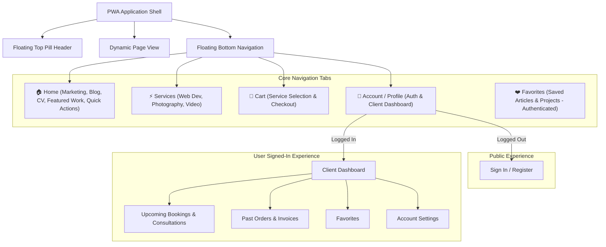

# Product Backlog: PWA Liquid Glass Transformation

> **Project**: [haikonguyen.eu](https://www.haikonguyen.eu)  
> **Target Release**: Modern Native-like Progressive Web App (PWA) with Liquid Glass Aesthetic  
> **Base Branch**: `feature/new-ui` (branched from `dev`)  
> **Design Inspiration**: `haianbeauty` architecture, iOS liquid glass design, mobile-first native PWA patterns.

---

## 🌟 1. Vision & Architectural Overview

The goal of this transformation is to evolve the current web portfolio into a high-performance, mobile-first **Progressive Web App (PWA)** featuring a **Liquid Glass** aesthetic. The app delivers a dual-context experience:

1. **Public View**: High-impact marketing & portfolio hub presenting personal brand narrative, latest articles (Keystatic + Cloudflare R2 CMS — see Epic 6), interactive CV, service offerings (Web Development, Photography, Video), cart, and quick-action launchers.
2. **Authenticated User View**: Native dashboard containing client profile status, upcoming service bookings with reschedule/cancellation, visit/inquiry history, saved favorites, and preferences.

### Key Design Pillars

- **Liquid Glass Aesthetic**: Translucent frosted glass layers (`backdrop-blur-2xl`, `border-white/10`, specular highlights, luminous cyan accents, soft ambient glows).
- **Mobile-First Native App Feel**: Floating top header pill, fixed floating bottom navigation bar with active tab indicators, spring animations, drawer sheets for actions, safe-area inset compliance (`env(safe-area-inset-*)`), and tap-highlight suppression.
- **Unified Responsive Shell**: Seamless transition from floating mobile pill elements to expansive, multi-column desktop dashboards.

---

## 🗺️ 2. Information Architecture & Navigation Logic



---

## 📋 3. Epics & Ticket Breakdown

### 🔷 Epic 1: PWA & Liquid Glass Core Foundation (Milestone 1 — Current Branch: `feature/new-ui`)

_Establish the foundational architecture, design tokens, layout shell, and navigation infrastructure._

#### `TICKET-PWA-00`: Upgrade Dependencies to Latest & Next.js 16.3.1 (Instant Navigation Support)

- **Description**: Upgrade core dependencies to match latest stable versions, specifically Next.js `^16.3.1`, React `19.2.7`, Tailwind CSS `4.3.1`, Zustand `5.0.14`, and add `lucide-react` for clean native-like icons, enabling Next.js 16.3+ instant navigation capabilities and prefetching.
- **Tasks**:
  - Update `package.json` with latest dependencies.
  - Configure `next.config.js` with performance / instant navigation settings.
  - Verify clean TypeScript build and dependency resolution.
- **Acceptance Criteria**: All packages updated to target versions without breaking changes; zero dependency conflicts.

#### `TICKET-PWA-01`: PWA Configuration & Mobile Web Native Shell

- **Description**: Configure Next.js Web App Manifest, Service Worker registration, and mobile-native viewport settings.
- **Tasks**:
  - Implement dynamic Next.js manifest (`src/app/manifest.ts`) with standalone display mode, theme colors, and icons.
  - Setup Service Worker registration (`src/components/pwa/PWARegister.tsx` + `public/sw.js`) with offline caching shell.
  - Configure viewport meta tags in `src/app/layout.tsx` for iOS safe-area handling (`viewport-fit=cover`).
  - Add native touch optimizations to global CSS (`-webkit-tap-highlight-color: transparent`, `overscroll-behavior: none`).
- **Acceptance Criteria**: App is installable as a standalone PWA on iOS/Android; passes PWA audit; notch safe-areas correctly padded.

#### `TICKET-PWA-02`: Liquid Glass Design Tokens & Tailwind Theme

- **Description**: Extend Tailwind 4 theme with glassmorphism utilities, luminous color tokens, and spring animation keyframes.
- **Tasks**:
  - Define CSS custom properties for frosted glass surfaces (`--glass-bg`, `--glass-border`, `--glass-blur`).
  - Configure brand accents: Cyan Glow (`#06b6d4`), Pure Charcoal/OLED Black (`#050505`), Translucent White overlays.
  - Add micro-interaction keyframes for sheet drawers, smooth fade-ins, and active tab scalings.
- **Acceptance Criteria**: Glassmorphism cards and navigation bars render consistently with specular highlights and smooth backdrop blur across both Dark and Light modes.

#### `TICKET-PWA-03`: `AppPageShell` & Adaptive Layout Wrapper

- **Description**: Create a shared layout shell (`AppPageShell`) that handles top floating header spacing, bottom navigation clearance, and responsive constraints.
- **Tasks**:
  - Create `AppPageShell.tsx` supporting multiple container sizes (`Default`, `Auth`, `Cart`, `Checkout`, `FullBleed`).
  - Implement automatic padding calculations using `env(safe-area-inset-top)` and `env(safe-area-inset-bottom)`.
  - Wrap application pages in `AppPageShell`.
- **Acceptance Criteria**: Content never clips behind floating top pill or bottom nav bar across all viewport sizes.

#### `TICKET-PWA-04`: Floating Liquid Glass Navigation Suite

- **Description**: Build floating top header and bottom navigation components with public/auth awareness.
- **Tasks**:
  - **Desktop Floating Header (`HeaderToolbar.tsx`)**: Centered glass pill for navigation links, right-hand pill for user avatar/login, cart badge, and theme toggle.
  - **Mobile Floating Header**: Compact brand logo pill + notification drawer trigger.
  - **Mobile Bottom Navigation (`BottomNavigation.tsx`)**: Floating bottom glass dock featuring 4-5 tabs (Home, Services, Cart with live count badge, Account) with active pill indicators and scale micro-interactions.
  - Create `src/components/layout/nav-items.ts` to manage tab configuration dynamically based on authentication state.
- **Acceptance Criteria**: Bottom navigation stays anchored and responds dynamically to active routes; tap states provide tactile feedback.

---

### 🔷 Epic 2: Public View – Modular Marketing & Interactive Home Hub (Milestone 2)

_Redesign the landing page into a native-like mobile personal brand hub._

#### `TICKET-HOME-01`: Native-First Hero & Quick-Action Launcher

- **Description**: Build the top hero profile card and 2x2 quick action launcher grid based on the mobile design.
- **Tasks**:
  - Hero card with rounded-3xl profile image, "Digital Studio" badge, title, and "View Latest Work" CTA button.
  - 2x2 Quick Action Grid:
    - 📅 **Book a 1:1**: Opens consultation modal/drawer.
    - ✉️ **Contact Me**: Direct trigger to contact sheet.
    - 📄 **Interactive CV**: Smooth scroll or modal trigger to CV view.
    - 📷 **Gear List / Work**: Direct shortcut to equipment & setup breakdown.
- **Acceptance Criteria**: Matches mobile native design mockup with glassmorphic tactile buttons.

#### `TICKET-HOME-02`: "What's New" Blog Showcase (Keystatic)

- **Description**: Dynamic blog preview card/carousel on the home view fed by the Keystatic reader (depends on Epic 6 / `TICKET-CMS-03`).
- **Tasks**:
  - Article preview card with cover image (R2 URL via `next/image`), category/tag badge, publication date, title, and excerpt.
  - "Read Article →" link with page transition to `/post/[slug]` (current route; not `/blog/[slug]`).
- **Acceptance Criteria**: Renders latest posts from Keystatic with skeleton loading states; zero Notion API calls.

#### `TICKET-HOME-03`: "Featured Work" Visual Showcase Hub

- **Description**: Interactive multi-disciplinary portfolio section featuring Web Dev, Photography, and Video.
- **Tasks**:
  - Category filtered grid/carousel (All, Dev, Photography, Vlogs).
  - Dev preview card with code syntax highlight snippet.
  - Photo preview card with lightbox zoom (`yet-another-react-lightbox`).
  - Vlog card with play button and video modal trigger.
- **Acceptance Criteria**: Seamless media previews with zero layout shifts and instant modal playback.

#### `TICKET-HOME-04`: Interactive CV & Career Journey Drawer

- **Description**: Modern interactive CV section with skill progress gauges, education credentials, and career timeline.
- **Tasks**:
  - Technical Arsenal skills grid with animated percentage bars.
  - Education & Certifications card.
  - Professional experience timeline with role descriptions and tech tags.
  - "Download PDF" resume action.
- **Acceptance Criteria**: Clean interactive display togglable between Story and CV modes.

---

### 🔷 Epic 3: Services & Booking / Inquiry Engine (Milestone 3)

_Build out dedicated service offerings, package pricing, and booking flows._

#### `TICKET-SRV-01`: Unified Services Catalog (`/services`)

- **Description**: Dedicated services catalog page with rich cards for each service discipline.
- **Tasks**:
  - **1. Web App Development**: Architecture, Full-stack Next.js, Performance Optimization, Custom UI/UX.
  - **2. Photography**: Commercial & Editorial, Event Coverage, Portrait Sessions, Visual Storytelling.
  - **3. Video & Filmmaking**: YouTube/Vlog Production, Promotional Teasers, Video Editing & Grading.
  - Deliverables checklist, estimated turnaround, and pricing/quote tiers for each service.
  - "Add to Cart" and "Inquire / Book" buttons.
- **Acceptance Criteria**: Clear, high-converting presentation of all offerings with direct cart integration.

#### `TICKET-SRV-02`: Interactive Consultation & Booking Flow

- **Description**: Multi-step booking/scheduling drawer for 1:1 sessions and service reservations.
- **Tasks**:
  - Date & time slot picker.
  - Scope questionnaire (project goals, budget, timelines).
  - Integration with calendar / Cal.com or direct inquiry dispatch via SendGrid.
- **Acceptance Criteria**: Users can book available slots with immediate validation and email confirmation.

---

### 🔷 Epic 4: Shopping Cart & Checkout Experience (Milestone 3)

_Implement cart state, floating badge indicators, and smooth checkout flow._

#### `TICKET-CART-01`: Persistent Cart Store & Floating Badge Indicator

- **Description**: Zustand-powered shopping & booking cart store with local storage persistence.
- **Tasks**:
  - State management for added services, consultation slots, and digital downloads.
  - Live count badge synchronized on desktop header and mobile bottom navigation.
- **Acceptance Criteria**: Items persist across page navigation and browser sessions.

#### `TICKET-CART-02`: Liquid Glass Cart Drawer & Checkout Summary (`/cart`, `/checkout`)

- **Description**: Slide-up liquid glass cart drawer on mobile and full checkout page on desktop.
- **Tasks**:
  - Itemized list with quantity adjustments, service notes, and remove actions.
  - Price summary breakdown (Subtotal, taxes/deposit if applicable).
  - Checkout form capturing client contact details and payment/inquiry submission.
- **Acceptance Criteria**: Seamless checkout experience with validation and success screen.

---

### 🔷 Epic 5: User Authentication & Client Dashboard (Milestone 4)

_Deliver full user dashboard, upcoming bookings management, and account settings._

#### `TICKET-AUTH-01`: Authentication Gateway & Session Management (`/login`, `/account`)

- **Description**: Unified login and registration modal/page with liquid glass styling.
- **Tasks**:
  - Magic Link / Email & Password authentication.
  - GitHub & Google OAuth login support.
  - Auth context & session hooks (`useAuth`, `useUser`).
- **Acceptance Criteria**: Secure session handling with automatic redirection and protected routes.

#### `TICKET-ACC-01`: Authenticated User Dashboard Layout (`/account`)

- **Description**: Responsive client dashboard inspired by `haianbeauty`.
- **Tasks**:
  - Desktop: Left sidebar with navigation tabs (Profile, Bookings, Favorites, History, Settings).
  - Mobile: Native segmented view or bottom sheet tab navigation.
  - Profile header with user avatar, name, and membership tier badge.
- **Acceptance Criteria**: Responsive split view on desktop and smooth native cards on mobile.

#### `TICKET-ACC-02`: Upcoming Bookings & Inquiries Management

- **Description**: Interactive cards for active bookings, upcoming consultations, and project milestones.
- **Tasks**:
  - Date & time badges with status indicators (Confirmed, Pending, In Review).
  - Reschedule and Cancellation actions with confirmation dialogs.
  - Direct link to meeting room or project briefing documents.
- **Acceptance Criteria**: Users can view and manage their scheduled services with real-time status updates.

#### `TICKET-ACC-03`: History, Invoices & Digital Assets

- **Description**: Historical log of completed services, past inquiries, downloadable invoices, and digital deliveries.
- **Tasks**:
  - Chronological list of completed projects and bookings.
  - Downloadable PDF invoices and receipts.
  - Download links for deliverables (photoshoots, code repositories, video edits).
- **Acceptance Criteria**: Complete historical audit trail accessible at any time.

#### `TICKET-ACC-04`: Favorites & Saved Content Hub (`/favorites`)

- **Description**: Bookmark and favorites hub for saved articles, projects, and service packages.
- **Tasks**:
  - Quick bookmarking toggle across blog posts, portfolio items, and services.
  - Dedicated favorites view under user account.
- **Acceptance Criteria**: Real-time bookmarking with instant UI feedback.

#### `TICKET-ACC-05`: Account Settings & Personalization

- **Description**: Client profile settings and display preferences.
- **Tasks**:
  - Update profile information (Name, Email, Phone, Company).
  - Notification preferences (Email notifications, booking reminders).
  - Theme mode toggle (Dark, Light, System) and language preferences.
- **Acceptance Criteria**: Preference changes persist immediately to database and local storage.

#### `TICKET-THEME-01`: Multi-Theme Engine & Light Mode Surface Adaptations

- **Description**: Complete color tokens and frosted glass adaptations for Light Mode across all pages, Bento grid cards, Notion blog renderers, forms, and custom components.
- **Tasks**:
  - Audit and replace hardcoded dark utility classes (`bg-black/85`, `bg-black/45`, `text-white`) with responsive theme-aware variables (`bg-card`, `bg-glass-surface`, `text-foreground`).
  - Create light-mode frosted glass variants with soft drop shadows and high-contrast typography.
  - Implement dynamic theme provider with system preference listener and instant toggle.
  - Adapt blog/Markdoc renderers (post-Keystatic) — not Notion block chrome.
- **Acceptance Criteria**: Seamless switching between Dark, Light, and System modes with full WCAG contrast and liquid glass styling across all 54 pages.

---

### 🔷 Epic 6: Keystatic CMS + Cloudflare R2 (Notion / ImageKit Replacement) — POC

_Replace the Notion-backed blog + About Story pipeline with Keystatic (Git-based CMS). Store all CMS media on Cloudflare R2 from day one (not `public/`). Keep near-zero subscription cost. Optimize for clean Next.js App Router data loading instead of Notion block trees._

#### Context (read before implementing)

- **Notion surface today is narrow**: blog database (`DATABASE_ID`) + About Story page (`ABOUT_PAGE_ID`) only. Portfolio, services, home, contact, cart, and About CV are already local constants + `messages/*`.
- **ImageKit is lightly used**: optional `imagekit_path` on posts + unused transform helpers; no in-app upload. R2 replaces it as the **single media store** for CMS images (blog covers now; portfolio gallery later).
- **Routes**: blog list `/blog`, post detail `/post/[slug]`, About Story via About tabs — do **not** invent `/blog/[slug]`.
- **i18n**: UI stays `next-intl` (`en`/`cs`/`vi`). CMS body stays **monolingual** for POC (same as Notion today).
- **Images**: CMS binaries → **R2 + custom domain** + `next/image`. App chrome (logo, favicon) may stay in `public/`. Do **not** put gallery/cover uploads in `public/` (deploy/Git bloat; Vercel CLI static upload caps: Hobby 100 MB / Pro 1 GB).
- **Transforms**: rely on Next.js Image Optimization for POC; revisit Cloudflare Image Resizing only if quotas become real.
- Follow root `AGENTS.md` / `SKILLS.md`: no `any`, no hardcoded UI strings, ≤150 LOC/file, Biome + `tsc`.

#### `TICKET-CMS-01`: Keystatic Install, Config & Admin Shell

- **Description**: Add Keystatic to the Next.js App Router app with local storage for the POC and an isolated admin UI.
- **Tasks**:
  - Install `@keystatic/core` and `@keystatic/next` (check Next 16.3+ / React 19 compatibility first).
  - Create root `keystatic.config.ts`:
    - Storage: `kind: 'local'` for POC (GitHub storage = follow-up, not required to merge POC).
    - Collection `posts` at `content/posts/*`: `title` (slug), `publishedDate`, `excerpt`, `tags`, `authorName`, `coverImage` (R2 URL/path string field for POC — not Git-hosted image blobs), Markdoc/document `content` (bold, italic, links, headings, blockquotes, code; optional Callout later).
    - Singleton `about` (or `about-story`) for the About Story body.
  - API: `src/app/api/keystatic/[...params]/route.ts` via `makeRouteHandler`.
  - Admin: `src/app/keystatic/[[...params]]/page.tsx` via `makePage`; isolated `src/app/keystatic/layout.tsx` (no public nav/footer).
  - Document required env stubs in `.env.example` (no secrets committed).
- **Acceptance Criteria**: `http://localhost:3000/keystatic` loads; creating a post writes under `content/posts/` without Notion.

#### `TICKET-CMS-02`: Cloudflare R2 Bucket, Public URL & Upload Helper

- **Description**: Provision R2 as the only CMS media backend for the POC (covers now; gallery-ready prefixes later).
- **Tasks**:
  - Create R2 bucket + public access via custom domain or r2.dev public URL.
  - Env: `R2_ACCOUNT_ID`, `R2_ACCESS_KEY_ID`, `R2_SECRET_ACCESS_KEY`, `R2_BUCKET_NAME`, `NEXT_PUBLIC_R2_PUBLIC_BASE_URL` (names may match existing CF conventions — keep consistent).
  - Server-only helper to build public object URLs; optional presigned PUT for admin/manual upload smoke test.
  - Keystatic `coverImage` stores the **public R2 URL or object key** (string). Upload path for POC: presigned PUT from a small server action/route **or** documented manual upload + paste URL — must not commit binaries to Git/`public/`.
  - Allow R2 host in `next.config.ts` `images.remotePatterns`.
  - Prefix convention: `blog/covers/…` now; reserve `portfolio/…` for later gallery (no need to build gallery UI in POC).
- **Acceptance Criteria**: A cover on R2 renders via `next/image` on a post card/hero; no ImageKit URL required.

#### `TICKET-CMS-03`: Type-Safe Reader & Rewire Blog / Post / About

- **Description**: Replace Notion fetch + block rendering on blog list, post detail, and About Story with Keystatic + Markdoc.
- **Tasks**:
  - `src/lib/keystatic.ts` (kebab-case modules OK under `src/lib/keystatic/`): `createReader`, `getAllPosts()`, `getPostBySlug(slug)`, `getAboutStory()`.
  - Rewire `src/app/blog/page.tsx`, `src/app/post/[slug]/page.tsx` (`generateStaticParams`, `generateMetadata`, OG from R2 cover), About Story data path.
  - Keep PostCard / PostHero / PostList / TagList UI; adapt props off flat frontmatter (drop Notion property nesting).
  - Render Markdoc with Tailwind typography; delete Notion block renderer usage from these routes.
  - Prefer build-time / static reads; remove `revalidate = 1` Notion chatter on migrated routes.
  - Migrate ≥1 real post + About Story sample into `content/` (Markdoc) so the site is demoable without Notion env.
- **Acceptance Criteria**: `/blog`, `/post/[slug]`, About Story work with Notion env vars unset; `generateStaticParams` lists Keystatic slugs.

#### `TICKET-CMS-04`: Remove Notion + ImageKit Dead Path (Feature Flag Flip)

- **Description**: After routes are green on Keystatic + R2, remove the old CMS/image adapter surface.
- **Tasks**:
  - Remove `@notionhq/client` usage and Notion env (`DATABASE_ID`, `NOTION_API_KEY`, `ABOUT_PAGE_ID`) from `.env.example` / docs once cut over.
  - Remove or quarantine `src/lib/notion/**`, Notion-specific blog loaders, `imagekit_path` plumbing, unused `@imagekit/nodejs` / provider if nothing remains.
  - Strip Notion/ImageKit hosts from `next.config.ts` when unused; keep Unsplash/local as needed.
  - Update any backlog/vision copy still saying “Notion API” (e.g. home showcase depends on Keystatic).
- **Acceptance Criteria**: App builds and serves blog/about with zero Notion/ImageKit runtime dependency for those features.

#### `TICKET-CMS-05`: Verification

- **Description**: Quality gate before merge to `dev`.
- **Tasks**:
  - `npx tsc --noEmit` and `npx biome check --write .` clean on touched tree.
  - `npm run build` succeeds; post routes pre-render from Keystatic.
  - Manual: edit via `/keystatic`, confirm content files update; confirm R2 cover displays.
  - Smoke mobile + desktop blog list/detail.
- **Acceptance Criteria**: Typecheck/lint/build green; POC demoable without Notion or ImageKit credentials.

#### Out of scope (explicit)

- Portfolio gallery UI / lightbox CMS (later epic; same R2 bucket/prefix).
- Multi-locale CMS bodies.
- Keystatic `kind: 'github'` production storage (follow-up ticket).
- Cloudflare Image Resizing / Images product.
- Bot/Grokbot upload automation (design R2 prefixes + presigned PUT so this is easy later; do not build the bot).
- Moving portfolio/services/home copy into Keystatic.

#### Agent prompt (copy for implementation agent)

```markdown
You are an expert full-stack TypeScript engineer on this repo (`haikonguyen-eu-notion`).
Read `AGENTS.md`, `SKILLS.md`, and Epic 6 in `BACKLOG.md` before coding.

### Objective
POC: replace Notion CMS (blog + About Story) with Keystatic; store all CMS images on Cloudflare R2 from day one. Near-zero subscription. Cleaner Next.js data layer (no Notion block trees).

### Must follow
- Next.js 16.3+ App Router, React 19, TypeScript strict, Biome, next-intl, Tailwind 4 only.
- No `any`, no hardcoded UI strings, ≤150 LOC/file, `"use client"` only when required.
- Routes: `/blog`, `/post/[slug]`, About Story tab — keep existing URLs.
- CMS media → R2 only (not `public/` except logo/favicon). Use `next/image` + `remotePatterns`.
- Storage: Keystatic `local` for POC. Content monolingual.
- Preserve PostCard/PostHero/list UI; swap data shape to flat Keystatic fields + R2 cover URL/key.
- After structural edits: `npx tsc --noEmit` and `npx biome check --write .`.
- Commit on branch `cursor/<descriptive-name>-af7e`, push, open/update PR into `dev`.

### Implement tickets in order
`TICKET-CMS-01` → `TICKET-CMS-02` → `TICKET-CMS-03` → `TICKET-CMS-04` → `TICKET-CMS-05`.

### Collections (keystatic.config.ts)
- `posts`: title/slug, publishedDate, excerpt, tags, authorName, coverImage (R2 URL or key string), Markdoc content.
- `about` singleton: Markdoc body for About Story.
- Do not Git-commit image binaries; R2 holds blobs.

### Done when
Blog + About Story work without `NOTION_*` / ImageKit; `/keystatic` edits local content files; covers load from R2 via `next/image`; tsc/biome/build pass.
```

---

## 🎯 4. Milestone Execution Roadmap

| Milestone                                          | Scope                        | Target Focus                                                                                                           |
| :------------------------------------------------- | :--------------------------- | :--------------------------------------------------------------------------------------------------------------------- |
| **Milestone 1 (Current Branch: `feature/new-ui`)** | **Core Foundation & Shell**  | PWA Manifest, Service Worker, Liquid Glass Design Tokens, `AppPageShell`, Floating Top Header & Bottom Navigation Bar. |
| **Milestone 2**                                    | **Public Experience Hub**    | Native Hero Card, Quick Action Launchers, Keystatic "What's New" Blog, Featured Work, Interactive CV.                  |
| **Milestone 2.5 / parallel**                       | **CMS POC (Epic 6)**         | Keystatic admin + reader, R2 covers, rewire `/blog` + `/post/[slug]` + About Story, remove Notion/ImageKit path.       |
| **Milestone 3**                                    | **Services & Commerce**      | Web Dev / Photo / Video Services Catalog, Booking Drawer, Cart Store, Checkout Flow.                                   |
| **Milestone 4**                                    | **Auth & Account Dashboard** | Authentication, Client Dashboard, Upcoming Bookings, Visit History, Invoices, Favorites, Settings.                     |
| **Later**                                          | **Portfolio gallery media**  | Large R2 uploads (`portfolio/` prefix), CMS/bot presigned uploads; still `next/image` (CF resizing only if needed).  |

---
